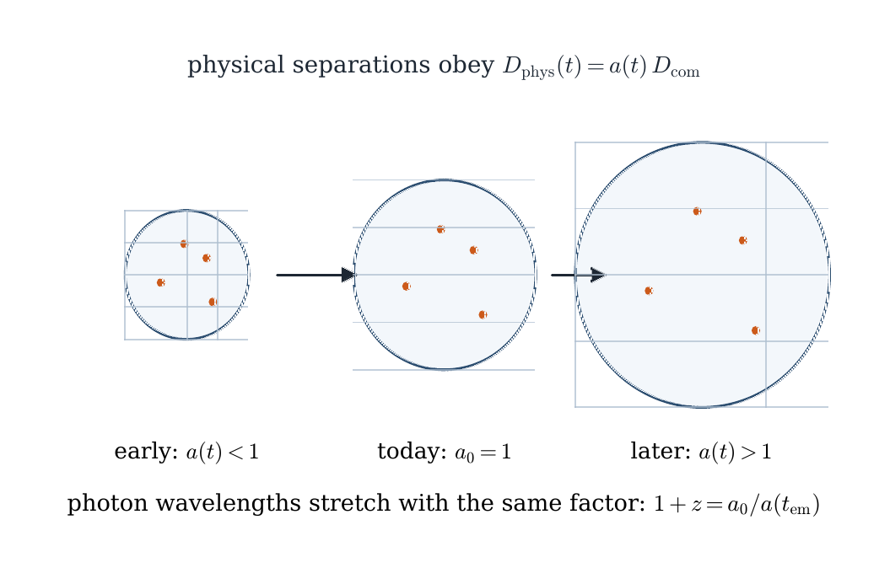
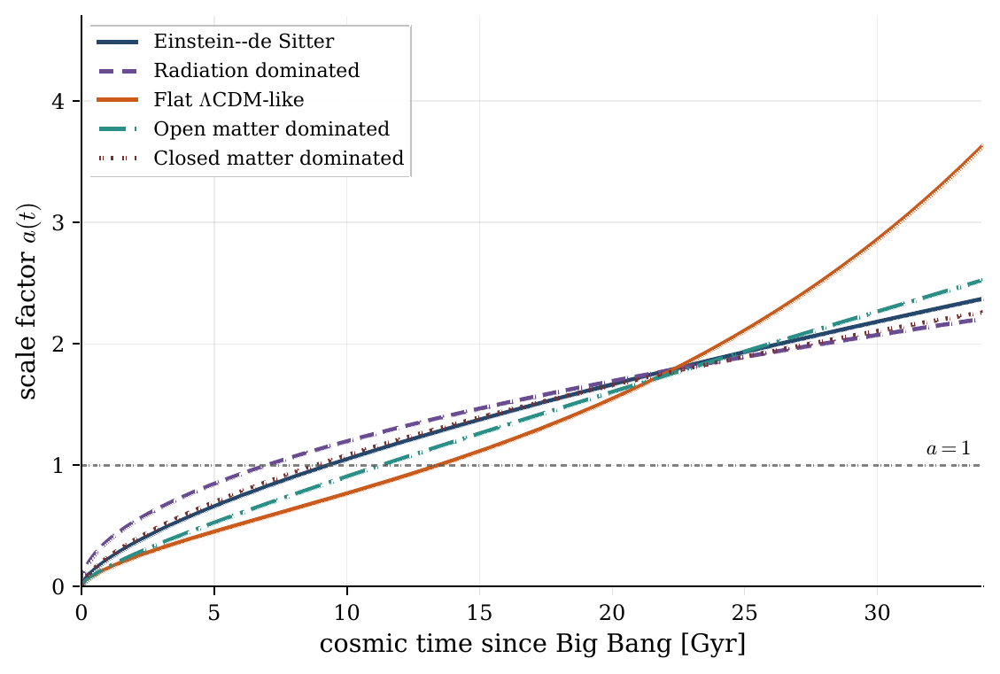
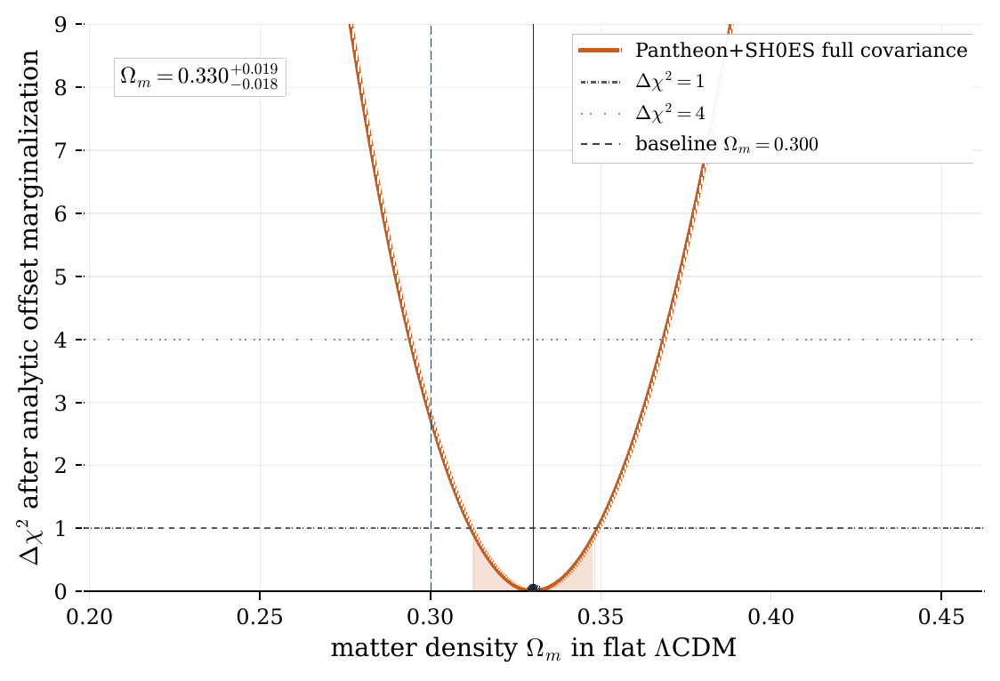
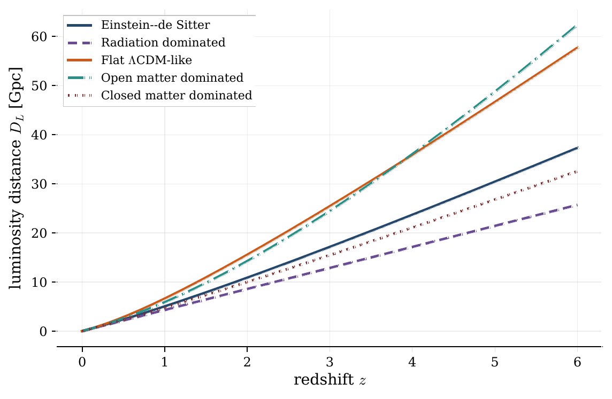
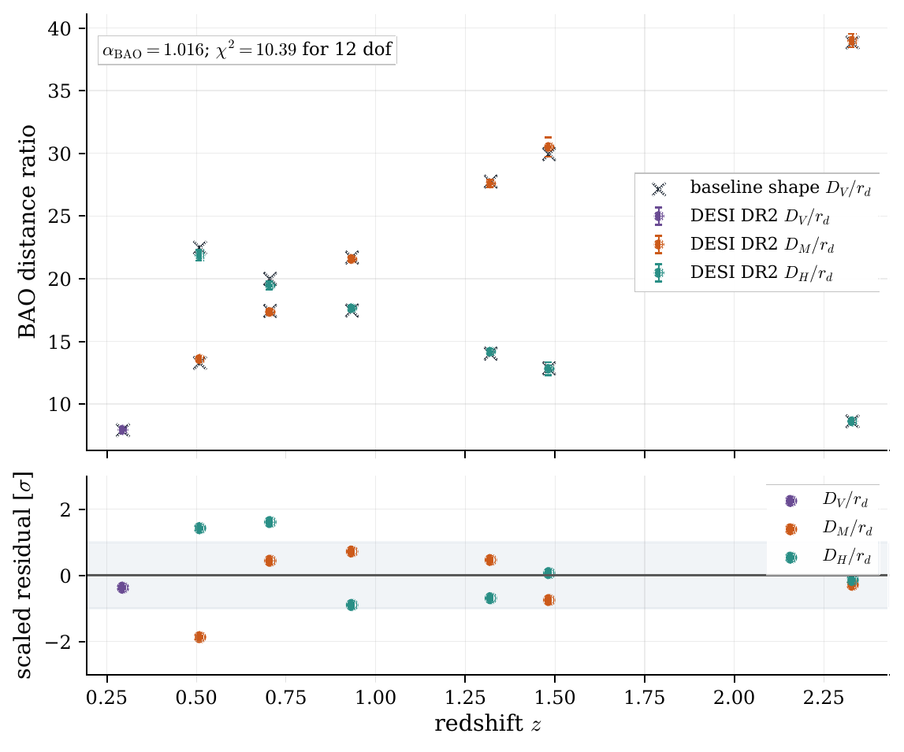
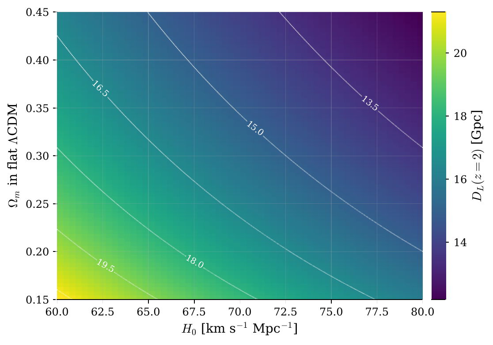
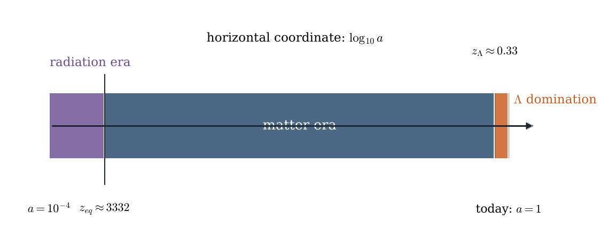

# FLRW numerical experiments

[](https://github.com/M3RCU3Y/FLRW/actions/workflows/reproduce.yml)


This is the code release for my FLRW cosmology project. It is a small,
reproducible Python package for computing background expansion histories,
cosmological distances, horizon scales, supernova distance fits, and a compact
DESI DR2 BAO consistency check.

The paper text is not included here. This repository is only the public
technical release: code, tests, retained public data files, generated figures,
and enough documentation for someone else to rerun the numerical work.

<p align="center">
  
</p>

## What this repo demonstrates

I wanted the calculations to be traceable from one compact expansion model,

```text
E(a)^2 = Omega_r a^-4 + Omega_m a^-3 + Omega_k a^-2 + Omega_Lambda,
```

through the quantities that actually get plotted or compared with data:

- scale-factor histories,
- lookback time and age of the universe,
- comoving, luminosity, and angular-diameter distances,
- particle horizons,
- density-era and acceleration-transition diagnostics,
- Pantheon+SH0ES distance-modulus checks,
- a full-covariance Pantheon+SH0ES shape likelihood,
- a DESI DR2 compressed BAO standard-ruler comparison.

The point is not to replace professional cosmology codes. The point is to make
the numerical chain readable, tested, and easy to reproduce.

## Result gallery

| Expansion and distances | Observational checks |
| --- | --- |
|  |  |
|  |  |
|  |  |

The vector originals live in `figures/`. The PNG files above are just
GitHub-friendly previews generated from those PDFs.

## Main numerical results

### Pantheon+SH0ES shape likelihood

The strongest observational calculation in the repo is a one-parameter
flat-LambdaCDM shape likelihood using the public Pantheon+SH0ES distance table
and STAT+SYS covariance matrix. The calculation:

- uses 1572 non-calibrator Hubble-flow supernovae,
- keeps the full retained covariance subset,
- profiles over one additive distance-modulus offset,
- reports the result as a shape reproducibility check, not as an `H0`
  measurement.

Generated result:

```text
Omega_m = 0.330 +0.019 -0.018
Delta_mu_0 = -0.099 mag
chi2_min = 1383.98
dof = 1570
reduced_chi2 = 0.882
```

### DESI DR2 BAO compressed-distance check

The BAO section compares the baseline expansion history with retained DESI DR2
compressed measurements for:

- `D_V / r_d`,
- `D_M / r_d`,
- `D_H / r_d`.

It then profiles one global multiplicative distance-scale nuisance:

```text
alpha_BAO = 1.016
fixed-scale chi2 = 43.40 for 13 data-vector entries
profiled-scale chi2 = 10.39 for 12 degrees of freedom
```

This is a standard-ruler consistency check. It is not a joint BAO cosmological
fit and does not claim new constraints.

## Quick start

```bash
python -m pip install -r requirements.txt
python -m pip install -e .
python scripts/download_pantheon_data.py --verify-only
pytest -q
python scripts/generate_cosmology_figures.py
```

Expected test output:

```text
12 passed
```

On Windows PowerShell, the same commands work with backslashes if preferred:

```powershell
python -m pip install -r requirements.txt
python -m pip install -e .
python scripts\download_pantheon_data.py --verify-only
pytest -q
python scripts\generate_cosmology_figures.py
```

## Repository layout

```text
.
|-- src/flrw_paper/             reusable package code
|   |-- core.py                 constants, units, integration helpers
|   |-- models.py               FLRW model definitions and diagnostics
|   |-- distances.py            distance, horizon, and age calculations
|   |-- datasets.py             retained data loading utilities
|   |-- likelihoods.py          Pantheon+ and BAO likelihood pieces
|   |-- plotting.py             figure styling and output helpers
|   `-- tables.py               generated table writers
|-- scripts/
|   |-- download_pantheon_data.py
|   `-- generate_cosmology_figures.py
|-- tests/
|   `-- test_cosmology_core.py
|-- data/                       retained public data inputs
|-- figures/                    regenerated PDF figures and TeX tables
|-- docs/
|   |-- assets/                 PNG previews used by this README
|   |-- FIGURE_INDEX.md
|   |-- DATA_PROVENANCE.md
|   |-- DATA_LICENSES.md
|   |-- REPRODUCIBILITY.md
|   `-- RESULTS_SUMMARY.md
|-- CITATION.cff
|-- LICENSE
|-- pyproject.toml
|-- requirements.txt
`-- requirements-lock.txt
```

## Tests

The test suite checks both the mathematical basics and the data-facing pieces:

- analytic age and distance limits,
- distance-duality consistency,
- curvature behavior,
- acceleration transition,
- agreement with Astropy `FlatLambdaCDM` under matching assumptions,
- Pantheon+ binned-anchor regression,
- full-covariance Pantheon+ likelihood regression,
- DESI DR2 BAO compressed-distance regression,
- dense-grid convergence.

Run:

```bash
pytest -q
```

## Data boundary

The retained data files are public Pantheon+SH0ES and DESI DR2-related BAO
inputs used for reproducibility. The provenance file records source URLs, file
sizes, and SHA-256 hashes:

- `docs/DATA_PROVENANCE.md`
- `docs/DATA_LICENSES.md`
- `data/README.md`

The code verifies the retained source files before regenerating outputs:

```bash
python scripts/download_pantheon_data.py --verify-only
```

## What is intentionally not here

This repository does not include:

- the writeup source,
- the compiled writeup PDF,
- private notes,
- bibliography source files,
- local build caches.

That separation is deliberate. The repo is meant to be a clean reproducibility
and results package.

## Reproducibility notes

`figures/` contains generated PDF figures and LaTeX-ready tables. They are
committed so the repository is useful immediately, but they are not hand-edited.
Regenerating them should be done through:

```bash
python scripts/generate_cosmology_figures.py
```

The README preview images can be refreshed from the vector PDFs with:

```bash
python scripts/render_readme_assets.py
```

GitHub Actions runs the data verification, test suite, and output regeneration
checks on push and pull request. Exact binary PDF equality is not enforced in
CI because PDF metadata and font rendering can vary across platforms; generated
tables are exact-diffed, and figure PDFs are checked as regenerated non-empty
outputs.

## Citation

If this repo is useful, cite the release metadata in `CITATION.cff`. The code is
MIT licensed. The retained public data files remain governed by their upstream
release terms and should be cited through the original data products as well.
